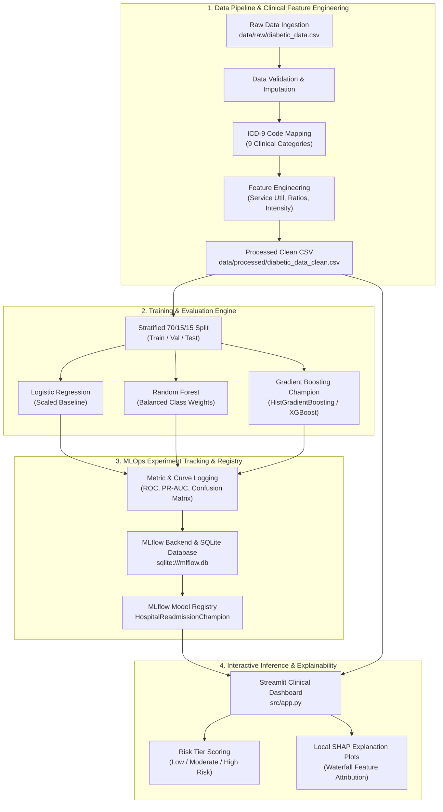

# Hospital Readmission Predictor — MLOps Pipeline

[](https://www.python.org/)
[](https://mlflow.org/)
[](https://streamlit.io/)
[](https://scikit-learn.org/)
[]()

An end-to-end Machine Learning and MLOps pipeline designed to predict early hospital readmissions (<30 days) for diabetic patients. Built on the **UCI Diabetes 130-US Hospitals dataset** (101,766 clinical records across 10 years of hospital admissions), this project establishes a reproducible data pipeline, multi-model evaluation framework, MLflow tracking/registry backend, and an interactive Streamlit inference dashboard with local SHAP explainability.

---

## Architecture & System Design

The system is structured into four decoupled layers: Data Preprocessing, Model Training & Evaluation, Experiment Tracking / Registry, and Real-Time Inference.



---

## Key Clinical Features & Domain Engineering

The raw dataset contains 50 features describing clinical encounters, laboratory results, and medications across 130 US hospitals.

### ICD-9 Diagnosis Code Categorization
High-cardinality primary, secondary, and tertiary ICD-9 diagnosis codes (`diag_1`, `diag_2`, `diag_3`) are mapped to 9 clinical categories based on medical classification standards:

| Clinical Category | ICD-9 Code Range / Definition |
| :--- | :--- |
| **Circulatory** | 390–459, 785 |
| **Respiratory** | 460–519, 786 |
| **Digestive** | 520–579, 787 |
| **Diabetes** | 250.xx |
| **Neoplasms** | 140–239 |
| **Injury** | 800–999 |
| **Musculoskeletal** | 710–739 |
| **Genitourinary** | 580–629, 788 |
| **Other** | All remaining codes, E/V codes |

### Engineered Clinical Indicators
| Feature | Calculation / Description | Clinical Rationale |
| :--- | :--- | :--- |
| `service_utilization` | `number_outpatient + number_emergency + number_inpatient` | Quantifies total patient healthcare exposure over the preceding year. |
| `emergency_ratio` | `number_emergency / (service_utilization + 1)` | Measures acute unplanned healthcare utilization. |
| `inpatient_ratio` | `number_inpatient / (service_utilization + 1)` | Measures past hospitalization frequency. |
| `med_per_day` | `num_medications / (time_in_hospital + 1e-5)` | Medication administration density during stay. |
| `lab_per_day` | `num_lab_procedures / (time_in_hospital + 1e-5)` | Diagnostic intensity per day of hospital stay. |
| `treatment_intensity` | `num_procedures + num_medications + num_lab_procedures` | Overall clinical workload during stay. |
| `is_high_risk_discharge` | Binary indicator (`discharge_disposition_id` in `[3, 5, 6, 11, 13, 14, 22]`) | Identifies transfers to Skilled Nursing Facilities (SNF), hospice, or home health care. |
| `num_med_changes` | Sum of medication adjustments (`Up` or `Down`) | Tracks active diabetic medication dosage changes during admission. |

---

## Model Benchmarking & Metric Results

Models are trained on 71,236 records and evaluated on validation (15,265 records) and held-out test sets (15,265 records) using a 3-fold Stratified Cross-Validation scheme. 

Because early readmissions (<30 days) represent ~11.2% of the dataset, models are evaluated on **Precision-Recall AUC (PR-AUC)** and **Brier Score** in addition to standard AUC-ROC and Macro F1 scores:

| Model Architecture | Validation AUC-ROC | PR-AUC | Macro F1 | CV AUC Mean | Model Role |
| :--- | :---: | :---: | :---: | :---: | :--- |
| **Logistic Regression** (Pipeline + StandardScaler) | 0.6543 | 0.2006 | 0.4783 | 0.6416 ± 0.006 | Baseline |
| **Random Forest** (Class Weight Balanced) | 0.6694 | 0.2144 | **0.5196** | 0.6545 ± 0.004 | Challenger |
| **HistGradientBoosting** (Gradient Boosted Trees) | **0.6804** | **0.2293** | 0.4780 | **0.6659 ± 0.004** | **👑 Champion Registered** |

### Held-Out Test Set Evaluation (Champion Model)
* **Test Set AUC-ROC**: `0.6697`
* **Test Set Macro F1**: `0.4780`
* **Test Set Brier Score**: `0.0892`

---

## Repository Structure

```text
hospital-readmission-mlops/
├── .github/
│   └── workflows/
│       └── ci.yml               # Automated GitHub Actions CI workflow
├── artifacts/                   # Generated metrics plots and model binaries
│   ├── champion_model.joblib    # Fallback serialized model binary
│   ├── HistGradientBoosting_confusion_matrix.png
│   └── HistGradientBoosting_performance_curves.png
├── data/
│   ├── raw/                     # Raw UCI dataset (diabetic_data.csv)
│   └── processed/               # Cleaned CSV & schema metadata
│       ├── diabetic_data_clean.csv
│       ├── feature_metadata.json
│       └── pipeline_log.json
├── src/
│   ├── __init__.py
│   ├── data_pipeline.py         # Data cleaning, ICD-9 mapping & feature engineering
│   ├── train.py                 # Cross-validation, MLflow logging & model registration
│   └── app.py                   # Streamlit clinical dashboard & SHAP explainability
├── tests/
│   └── test_pipeline.py         # Pytest test suite for preprocessing & validation
├── requirements.txt             # Dependency definitions
└── README.md                    # Project documentation
```

---

## Execution Guide

### 1. Environment Setup

```bash
git clone https://github.com/naveditachaudhary-pixel/hospital-readmission-mlops.git
cd hospital-readmission-mlops

# Create and activate virtual environment
python3 -m venv .venv
source .venv/bin/activate

# Install dependencies
pip install -r requirements.txt
```

### 2. Execute Data Cleaning & Feature Pipeline

```bash
python src/data_pipeline.py
```
*Output*: Generates `data/processed/diabetic_data_clean.csv` (101,766 rows × 53 features) and `data/processed/feature_metadata.json`.

### 3. Model Training & MLflow Logging

```bash
python src/train.py
```
*Output*: Trains all model architectures, computes cross-validation metrics, logs performance curves to `artifacts/`, populates `sqlite:///mlflow.db`, and registers `HospitalReadmissionChampion`.

### 4. Launch MLflow Experiment Dashboard

```bash
mlflow ui --backend-store-uri sqlite:///mlflow.db
```
View run histories, metric comparisons, confusion matrices, and registered model versions at `http://localhost:5000`.

### 5. Launch Interactive Clinical Dashboard

```bash
streamlit run src/app.py
```
Access the dashboard at `http://localhost:8501`. Features include:
* **Random Patient Sampler**: Tests predictions on real clinical records.
* **Interactive Patient Builder**: Customizes patient demographics, stay duration, lab procedure counts, and diagnosis categories.
* **Clinical Protocol Generator**: Displays post-discharge care protocols based on risk tier (*Low Risk*, *Moderate Risk*, *High Risk*).
* **SHAP Explanation**: Displays waterfall plots attributing individual feature contributions to the final risk score.

### 6. Run Test Suite

```bash
PYTHONPATH=. pytest tests/
```

---

## License

This project is licensed under the MIT License.