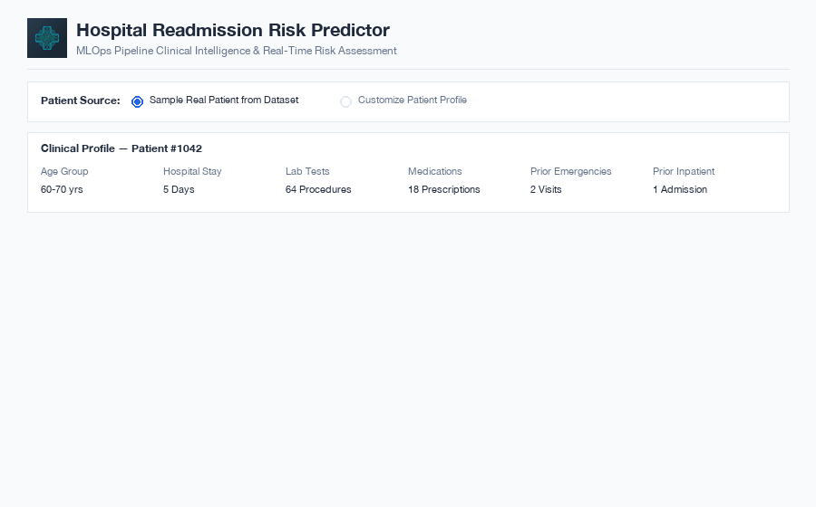
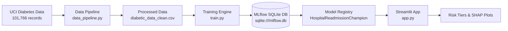

# Hospital Readmission Predictor

**End-to-end MLOps pipeline and clinical dashboard for predicting 30-day early hospital readmissions in diabetic patients.**



An end-to-end machine learning pipeline built on the UCI Diabetes 130-US Hospitals dataset (101,766 patient records). It cleans raw clinical data, engineers domain-specific features, tracks training runs with MLflow, and serves real-time risk scores with SHAP explanations via Streamlit.

- **Data Pipeline:** Maps high-cardinality ICD-9 diagnosis codes to 9 clinical categories and engineers encounter metrics (service utilization, emergency ratio, treatment intensity).
- **Model Training:** Trains and compares Logistic Regression, Random Forest, and HistGradientBoosting using 3-fold Stratified Cross-Validation.
- **MLOps & Tracking:** Logs parameters, ROC/PR curves, confusion matrices, and model versions to an MLflow SQLite database.
- **Clinical Dashboard:** Interactive Streamlit interface to sample patients or enter custom clinical data, scoring patients into Risk Tiers (Low, Moderate, High) with SHAP waterfall plots.

---

## Why

Hospital readmissions within 30 days are costly for healthcare systems and indicate potential gaps in post-discharge care. Under programs like the CMS Hospital Readmissions Reduction Program (HRRP), hospitals face financial penalties for high readmission rates. Early prediction allows clinical teams to assign targeted interventions (e.g., 48-hour follow-up calls, pharmacy consultations, home health support) before discharge.

---

## Quick start

```bash
# Clone the repository
git clone https://github.com/naveditachaudhary-pixel/hospital-readmission-mlops.git
cd hospital-readmission-mlops

# Set up virtual environment and dependencies
python3 -m venv .venv
source .venv/bin/activate
pip install -r requirements.txt

# Run data pipeline, model training, and web app
python src/data_pipeline.py
python src/train.py
streamlit run src/app.py
```

Open `http://localhost:8501` to view the Streamlit dashboard.

To view experiment runs and registered models in MLflow:
```bash
mlflow ui --backend-store-uri sqlite:///mlflow.db
```
Open `http://localhost:5000`.

---

## Architecture



---

## Model Performance

Models evaluated on a 70/15/15 train/validation/test split:

| Model | Validation AUC-ROC | PR-AUC | Macro F1 | Role |
|---|---|---|---|---|
| Logistic Regression | 0.6543 | 0.2006 | 0.4783 | Baseline |
| Random Forest | 0.6694 | 0.2144 | **0.5196** | Challenger |
| **HistGradientBoosting** | **0.6804** | **0.2293** | 0.4780 | **Champion Registered** |

- **Test Set AUC-ROC (Champion):** `0.6697`
- **Test Set Macro F1:** `0.4780`
- **Test Set Brier Score:** `0.0892`

---

## Features Engineered

| Feature | Description |
|---|---|
| `diag_1_cat`, `diag_2_cat`, `diag_3_cat` | ICD-9 codes mapped to: Circulatory, Diabetes, Respiratory, Digestive, Neoplasms, Injury, Musculoskeletal, Genitourinary, Other |
| `service_utilization` | Total prior encounters (`number_outpatient + number_emergency + number_inpatient`) |
| `emergency_ratio` | Proportion of prior visits that were emergency room admissions |
| `inpatient_ratio` | Proportion of prior visits that were inpatient hospitalizations |
| `med_per_day` | Prescribed medications divided by hospital length of stay |
| `lab_per_day` | Lab procedures divided by hospital length of stay |
| `treatment_intensity` | Combined count of lab tests, procedures, and medications |
| `is_high_risk_discharge` | Indicator for transfer to Skilled Nursing Facility, hospice, or home health |
| `num_med_changes` | Total number of diabetes medication dosage adjustments during admission |

---

## Project Structure

```text
hospital-readmission-mlops/
├── .github/workflows/ci.yml     # GitHub Actions CI
├── artifacts/                   # Saved plots and fallback model binary
│   └── champion_model.joblib
├── data/
│   ├── raw/                     # Raw diabetic_data.csv
│   └── processed/               # Processed CSV & feature metadata
├── src/
│   ├── data_pipeline.py         # Data cleaning & ICD-9 feature engineering
│   ├── train.py                 # Cross-validation & MLflow model tracking
│   └── app.py                   # Streamlit dashboard & SHAP explainability
├── tests/
│   └── test_pipeline.py         # Pytest test suite
├── requirements.txt
└── README.md
```

---

## Testing

Run unit tests:
```bash
PYTHONPATH=. pytest tests/
```

---

## License

MIT © 2026 Navedita Chaudhary