# 🏥 Hospital Readmission Risk Predictor — MLOps Clinical Pipeline


An end-to-end production-grade Machine Learning and MLOps pipeline to predict **early hospital readmissions (<30 days)** for diabetic patients using the UCI Diabetes 130-US Hospitals clinical dataset (101,766 patient records).

---

## 📌 Key Highlights & MLOps Features

- 🏥 **ICD-9 Clinical Category Mapping**: Transforms raw high-cardinality diagnosis codes (`diag_1`, `diag_2`, `diag_3`) into 9 core clinical categories (Circulatory, Diabetes, Respiratory, Digestive, Neoplasms, Injury, Musculoskeletal, Genitourinary, and Other).
- 🔬 **Clinical Feature Engineering**: Engineers 8 domain features including `service_utilization`, `emergency_ratio`, `inpatient_ratio`, `med_per_day`, `treatment_intensity`, `num_med_changes`, and `is_high_risk_discharge`.
- 📊 **Robust Model Benchmarking**: Evaluates Logistic Regression, Random Forest, and Gradient Boosting models using 3-fold Stratified Cross-Validation, **PR-AUC (Precision-Recall)**, Brier probability calibration score, AUC-ROC, and F1-macro metrics.
- 🎯 **MLflow Experiment Tracking & Registry**: Logs model hyperparams, validation curves (ROC/PR curves), confusion matrices, feature artifacts, and automatically registers the champion model (`HospitalReadmissionChampion`).
- 🖥️ **Interactive Streamlit Web Dashboard**: Features live dual-mode inference (Random Patient Sampling & Interactive Clinical Patient Builder), dynamic Risk Tier categorization (Low, Moderate, High Risk), actionable post-discharge clinical recommendations, and local **SHAP Waterfall plot** explanations.

---

## 🏗️ Architecture & Data Lineage

```mermaid
flowchart LR
    A[UCI Diabetes Dataset\n101,766 Patient Records] --> B[Data Pipeline\nsrc/data_pipeline.py]
    B --> C[Clinical Feature Engineering\nICD-9 Mapping & Imputation]
    C --> D[Cleaned Dataset\ndata/processed/diabetic_data_clean.csv]
    D --> E[Model Training & Tracking\nsrc/train.py]
    E --> F[MLflow Tracking & SQLite DB\nsqlite:///mlflow.db]
    F --> G[MLflow Model Registry\nHospitalReadmissionChampion]
    G --> H[Streamlit Web App\nsrc/app.py]
    H --> I[Live Risk Tier & SHAP Explanation]
```



---

## 📁 Repository Structure

```text
hospital-readmission-mlops/
├── .github/
│   └── workflows/
│       └── ci.yml               # GitHub Actions CI pipeline
├── artifacts/                   # Saved model artifacts & figure plots
│   ├── champion_model.joblib    # Fallback champion model joblib file
│   ├── HistGradientBoosting_confusion_matrix.png
│   └── HistGradientBoosting_performance_curves.png
├── data/
│   ├── raw/                     # Raw dataset (diabetic_data.csv)
│   └── processed/               # Processed CSV & feature metadata
│       ├── diabetic_data_clean.csv
│       ├── feature_metadata.json
│       └── pipeline_log.json
├── src/
│   ├── __init__.py
│   ├── data_pipeline.py         # Data cleaning & clinical feature engineering
│   ├── train.py                 # Model training, CV, MLflow tracking & registry
│   └── app.py                   # Streamlit live interactive dashboard
├── tests/
│   └── test_pipeline.py         # Pytest unit tests for preprocessing & schema
├── requirements.txt             # Cross-platform Python dependencies
└── README.md                    # Project documentation
```

---

## 📈 Model Evaluation & Performance Benchmarks

Models were evaluated over a stratified 70/15/15 train/validation/test split with class-imbalance ratio handling:

| Model | Validation AUC-ROC | PR-AUC | Macro F1 | CV AUC Mean | Model Status |
| :--- | :---: | :---: | :---: | :---: | :--- |
| **Logistic Regression** (Baseline) | 0.6543 | 0.2006 | 0.4783 | 0.6416 ± 0.006 | Baseline Scaled Model |
| **Random Forest** (Challenger) | 0.6694 | 0.2144 | **0.5196** | 0.6545 ± 0.004 | Balanced Class Weights |
| **HistGradientBoosting / XGBoost** | **0.6804** | **0.2293** | 0.4780 | **0.6659 ± 0.004** | 👑 Registered Champion |

---

## ⚡ Quick Start & Execution Guide

### 1. Clone & Set Up Environment

```bash
git clone https://github.com/naveditachaudhary-pixel/hospital-readmission-mlops.git
cd hospital-readmission-mlops

# Create virtual environment
python3 -m venv .venv
source .venv/bin/activate

# Install requirements
pip install -r requirements.txt
```

### 2. Run Data Cleaning & Feature Engineering

```bash
python src/data_pipeline.py
```

### 3. Train Models & Track Experiments with MLflow

```bash
python src/train.py
```

### 4. Launch MLflow Tracking UI

```bash
mlflow ui --backend-store-uri sqlite:///mlflow.db
```
Navigate to `http://localhost:5000` to inspect experiment metrics, artifacts, and registered models.

### 5. Launch the Live Streamlit Dashboard

```bash
streamlit run src/app.py
```
Navigate to `http://localhost:8501` to test live patient predictions and view SHAP explanations.

### 6. Run Unit Tests

```bash
PYTHONPATH=. pytest tests/
```

---

## 📜 License

Distributed under the MIT License.